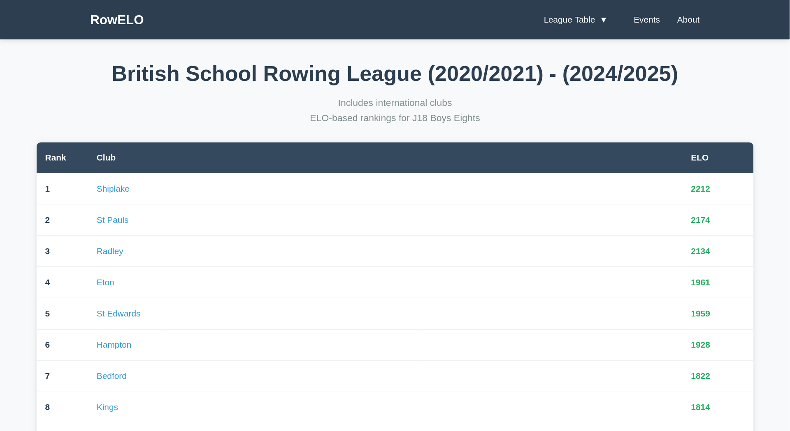
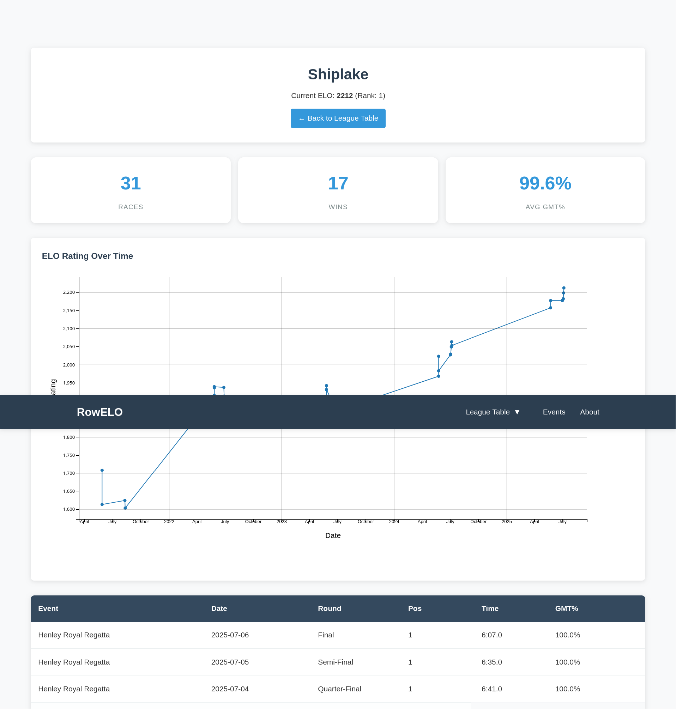

# RowELO

An automated data pipeline and Elo ranking system for British junior rowing. RowELO scrapes regatta results, cleans and stores them in a relational database, calculates dynamic ELO based club ratings, and publishes the results as a static website.

**Live demo:** https://alecscales.github.io/rowelo



Uses Python, MySQL, asyncio, requests_html, BeautifulSoup, Matplotlib, mpld3

## How it works

1. **Scrape:** asynchronous scrapers collect raw results from each regatta. (scraper_1shorr.py, scraper_2nsr.py, scraper_3henley.py)
2. **Clean:** names and formats are normalised before anything is stored. (importer.py)
3. **Store:** results are written to the relational database. (importer.py)
4. **Rate:** the Elo algorithm processes races in order and updates each club's rating. (elo_calculator.py)
5. **Generate:** a static site generator renders the league table, club pages and charts. (htmlgen.py)



## Running it locally

```bash
git clone https://github.com/AlecScales/rowelo.git
cd rowelo
pip install -r requirements.txt
# set up a MySQL / MariaDB server, and configure settings to connect in config.py then:
python main.py
```
